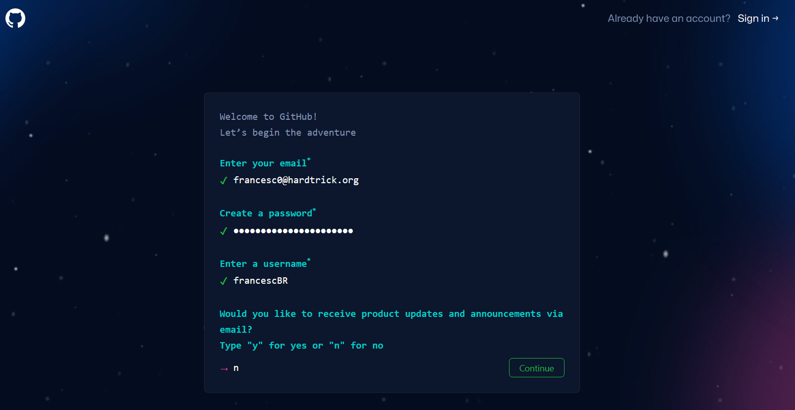
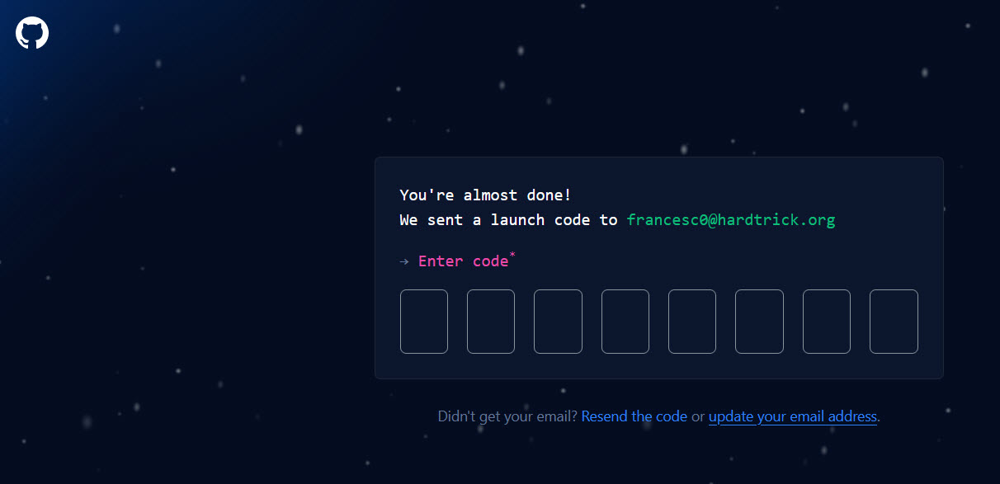
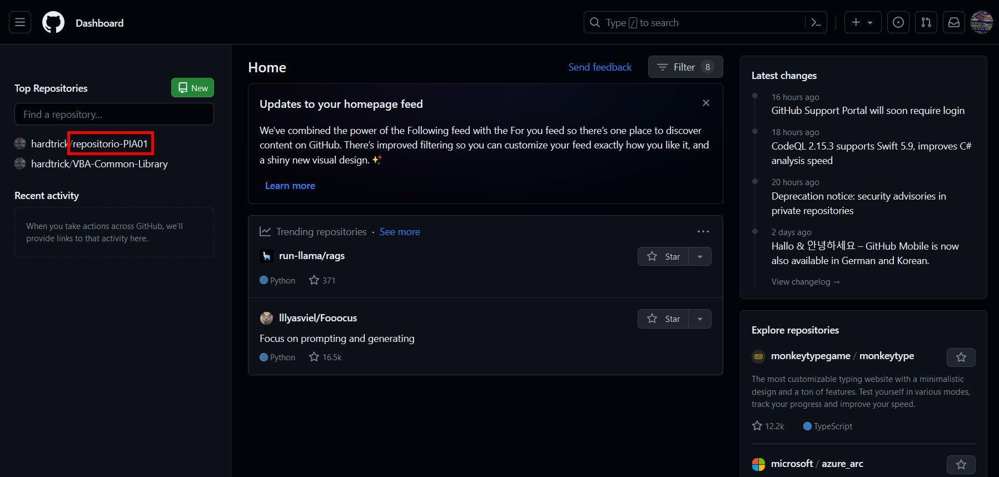
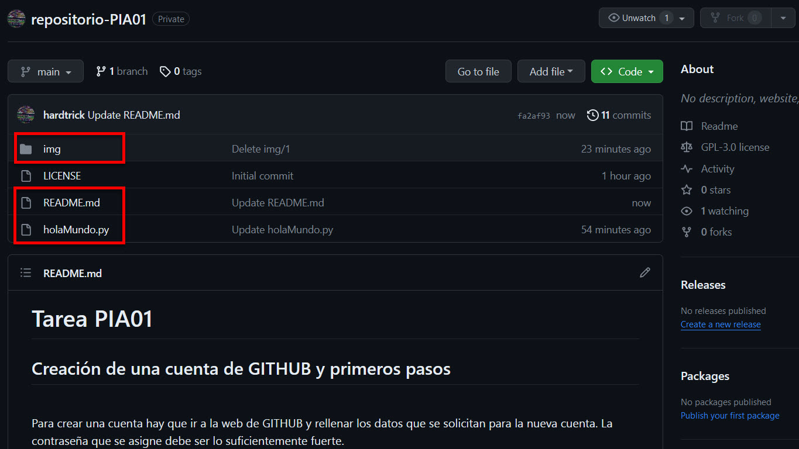
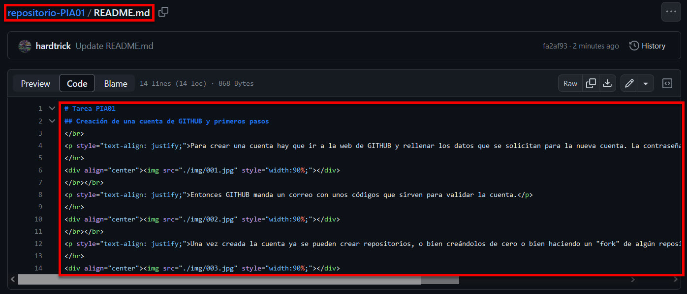
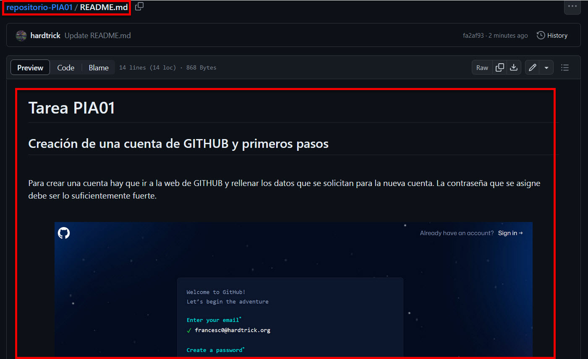
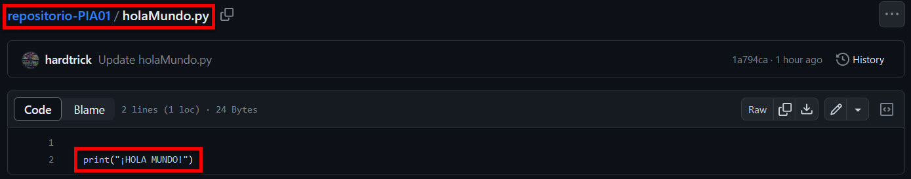

# Tarea PIA01  
## Creación de una cuenta de GITHUB y primeros pasos
 

Para crear una cuenta hay que ir a la web de <a href="https://github.com">GITHUB</a> y rellenar los datos que se solicitan para la nueva cuenta. La contraseña que se asigne debe ser lo suficientemente fuerte.

 

  

Entonces <a href="https://github.com">GITHUB</a> manda un correo con unos códigos que sirven para validar la cuenta.

 

  

Una vez creada la cuenta ya se pueden crear repositorios, o bien creándolos de cero o bien haciendo un "fork" de algún repositorio ya existente en alguna otra cuenta.

 

  

Después de haber creado un repositorio se pueden añadir los archivos que se desee tener dentro de él. Si es necesario se le puede dar una estructura de directorios para mantener agrupaciones de archivos, por ejemplo, para separar imágenes del resto de contenido.

 

  

Y a partir de este punto es cuando hay que dar rienda suelta a la creatividad y al esfuerzo, e ir añadiendo contenido al proyecto contenido en el repositorio.

 

 

 

